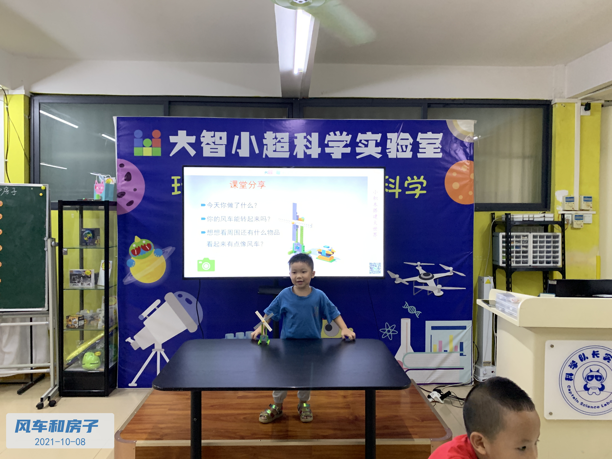

# 简单的黄色背景标签

* 用于电子版发送给家长
  


# 带知识点的灰色背景标签

* 用于冲印  
  

* 操作方法：
  * picasa中导出“每周课程16”标签照片，导出文件夹如：在“I:\学期汇总照片\2022春”，导出文件夹命名如：“2022春-每周课程16”
* 
  * 运行dzxcClass中的以下代码：
  ```
  #学期末为照片加上灰背景及知识点等
    stdpicWhiteMark(height=2250,term='2022春',crop='yes',bigger='yes',weekday=[5])
  ```


# 每次课后简单打标

* 用于课后发给家长




